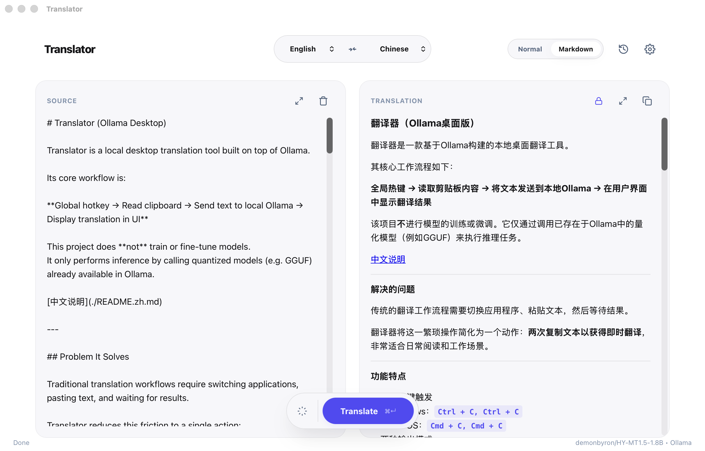

# Translator (Ollama Desktop)

Translator is a desktop translation tool built on top of Ollama.



Its core workflow is:

**Copy twice → read the clipboard (text, or an image through OCR) → translate with an Ollama model → show the translation**

This project does **not** train or fine-tune models.
It only runs inference against models already available in Ollama.

[中文说明](./README.zh.md)

---

## Features

- Global hotkey: `Cmd+C Cmd+C` on macOS, `Ctrl+C Ctrl+C` on Windows. The result opens in a small window next to the pointer (copy, open in the main window, `Esc` to go back), or in the main window if you turn that off
- Translation only, or side by side with each source paragraph above its translation
- Per paragraph: show the original inline, copy it, or translate it again
- Glossary: fixed translations for terms, sent to the model only when the term appears in the text
- Markdown mode keeps headings, lists, quotes and tables (rendered GitHub-style), and leaves code untouched
- Images on the clipboard go through system OCR from every entry point: the hotkey, the clipboard button, the tray menu, and pasting into the source box
- Ollama on this machine or on another host

## How translation works

Small translation models keep names and terms consistent across a passage when they see the whole passage, and they are faster that way than with one request per paragraph. So Translator:

1. Joins lines broken in the middle of a sentence (text copied from a PDF, OCR output) back into paragraphs.
2. Groups consecutive paragraphs into chunks of about 700 tokens and sends each chunk in one request, paragraphs separated by blank lines. The last paragraphs of the previous chunk go along as an earlier chat turn.
3. Splits the reply back into paragraphs and pairs each with its source. If the model merged or split paragraphs, that chunk is translated again one paragraph at a time, so pairs never drift.

Prompts follow each model's card. Settings can pick a family by hand (for a model whose name does not say what it is) or use a custom template with `{text}`, `{target_lang}`, `{target_lang_zh}` and `{glossary}`.

| Model family | Detected from the model name | Prompt |
|---|---|---|
| Index-Translate (bilibili) | `index-translate` | `请将以下文本翻译为{目标语言}，直接输出翻译结果，不要进行任何解释。` |
| Hy-MT / HY-MT / Hunyuan-MT (Tencent) | `hy-mt`, `hunyuan-mt` | `将以下文本翻译为{目标语言}，注意只需要输出翻译后的结果，不要额外解释：` |
| Anything else | | A plain English instruction |

Glossary terms use each family's documented terminology wording: Index-Translate's `要求：术语使用固定译法（…）` and Hy-MT's `参考下面的翻译：{原文} 翻译成 {译文}`.

Markdown is split into blocks with markdown-it-py, the same CommonMark rules the display uses. Code, HTML blocks, thematic breaks and link definitions are not sent to the model; reference links are rewritten as inline links first.

Requests send `think: false`. Ollama treats Index-Translate as a reasoning model, and without the flag the prompt it renders differs from the format the model was trained on.

## OCR

- **macOS**: system Vision OCR with automatic language detection
- **Windows**: WinRT OCR (requires the system OCR language packs)

When the clipboard holds both text and a picture (Office does this), the text wins. A picture wins when the only text is its file name or URL.

## Configuration

- **macOS**: `~/Library/Application Support/Translator/ui_config.json`
- **Windows**: `%APPDATA%/Translator/ui_config.json`

If the config file is unreadable, Translator moves it aside with a no-clobber `.corrupt` suffix and loads defaults.

## Architecture

- `src/`: React UI
- `src-tauri/`: Tauri shell: window, tray, global hotkey, and the commands that run the Python bridge
- `python_backend/bridge.py`: one process per command (`translate-stream`, `read-clipboard`, `list-models`, …), JSON over stdout
- `core/`: splitting, prompts, chunked translation pipeline
- `backend/`: Ollama HTTP client
- `ui_mac/ocr.py`, `ui_windows/`: OCR and the Windows hotkey listener

Release builds carry the bridge, built with PyInstaller, in the app's resources: `npm run build:macos` and `npm run build:windows` (see `AGENTS.md`). A macOS build without it (`npm run tauri:dev`, plain `tauri build`) runs the bridge from this checkout's `.venv`; set `TRANSLATOR_BACKEND_ROOT` at build time to point at another checkout.

## Development

```bash
python3 -m unittest discover -s tests -v
npm run build:frontend
cargo check --manifest-path src-tauri/Cargo.toml
npm run tauri:dev
```

`python3 python_backend/api_server.py` serves the same backend over HTTP on port 8765 for running the UI in a browser with `npm run dev`.

Set `TRANSLATOR_STARTUP_LOG=1` and optionally `TRANSLATOR_STARTUP_LOG_FILE=<path>` to inspect Python bridge startup stages.

## Limitations

- Translation quality depends on the model
- OCR relies on system language packs
- OCR returns lines in the order Vision gives them; multi-column screenshots can come out interleaved

## Roadmap

- Translate text inside an image and draw the translation back onto it
- OCR with document structure (paragraphs, columns) through Vision's `RecognizeDocumentsRequest`
